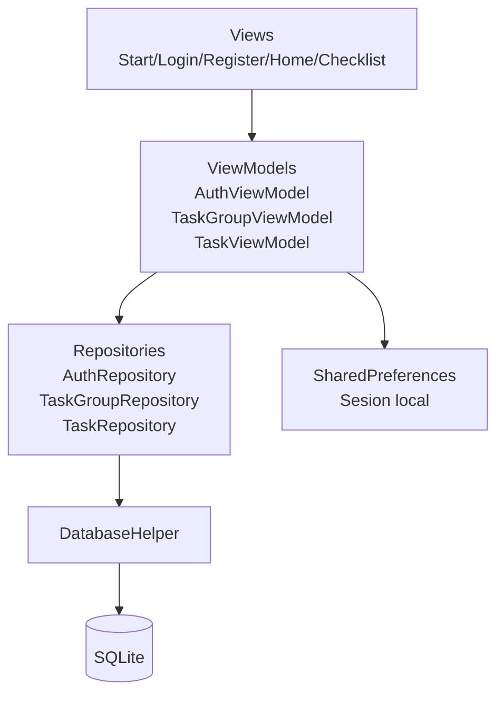
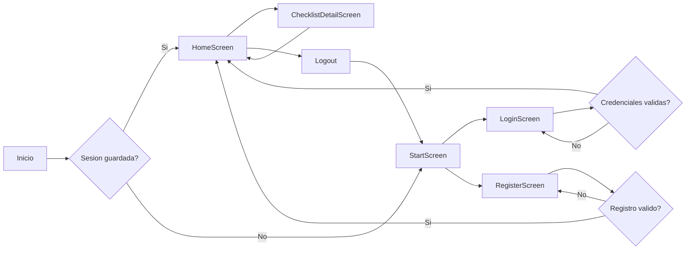
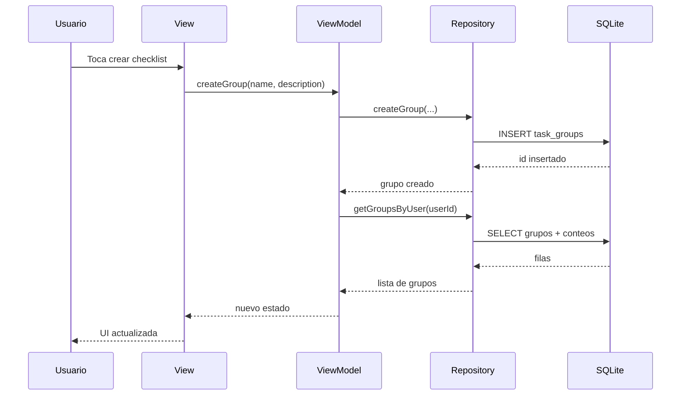
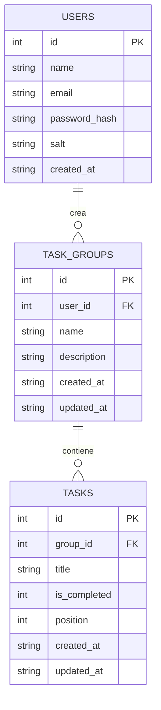
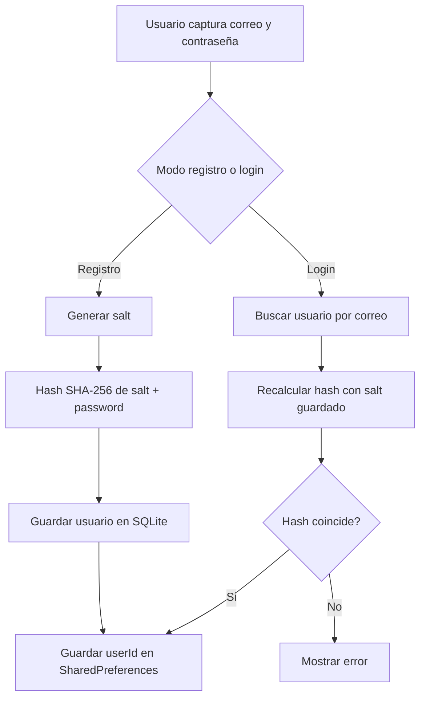

# AutenticacionApp

Aplicación móvil de ejemplo construida con Flutter para demostrar un flujo completo de autenticación local y CRUD con SQLite siguiendo arquitectura MVVM y manejo de estado con Riverpod.

## Objetivo del proyecto

Este proyecto existe para explicar, con una implementación real y pequeña, cómo conectar una app Flutter a una base de datos SQLite local y cómo modelar un caso práctico con:

- registro de usuarios
- inicio de sesión
- persistencia de sesión local
- creación de grupos de tareas o checklist
- agregado, edición, marcado y eliminación de tareas individuales
- separación por capas usando MVVM
- estado reactivo usando Riverpod

## Funcionalidades

- Pantalla inicial con branding, animación y acceso a login o registro.
- Registro de usuarios con persistencia local en SQLite.
- Inicio de sesión con validación de credenciales.
- Persistencia de sesión con `SharedPreferences`.
- Pantalla principal con todos los checklist del usuario autenticado.
- CRUD de grupos de tareas.
- CRUD de tareas individuales dentro de cada checklist.
- Marcado de tareas como completadas con checkbox.
- Eliminación y edición por elemento usando `flutter_slidable`.
- UI moderna con animaciones suaves usando `flutter_animate`.

## Stack técnico

| Tecnología | Uso |
| --- | --- |
| Flutter | UI multiplataforma |
| SQLite (`sqflite`) | Persistencia local |
| Riverpod | State management |
| GoRouter | Navegación y guardas de autenticación |
| SharedPreferences | Persistencia de sesión |
| Crypto | Hash seguro de contraseña con salt |
| Flutter Animate | Animaciones de entrada y transiciones suaves |
| Flutter Slidable | Acciones de editar y eliminar en listas |
| Google Fonts | Tipografía personalizada |

## Arquitectura

La aplicación sigue una estructura MVVM clara:

- `Model`: entidades y mapeo SQLite (`UserModel`, `TaskGroupModel`, `TaskModel`)
- `ViewModel`: lógica de estado y coordinación de casos de uso (`AuthViewModel`, `TaskGroupViewModel`, `TaskViewModel`)
- `View`: pantallas y widgets reutilizables
- `Repository`: acceso a datos para aislar la base de datos de la UI
- `DatabaseHelper`: punto único de configuración y apertura de SQLite

### Diagrama de arquitectura



## Flujo general de la app



## Flujo MVVM y Riverpod



## Modelo de datos

La app usa tres tablas principales.

### Diagrama entidad-relación



## Lógica del login

Para mantener el ejemplo simple pero correcto a nivel didáctico, la contraseña no se guarda en texto plano.

1. En registro se genera un `salt` aleatorio.
2. Se calcula `SHA-256(salt + password)`.
3. Se guardan `password_hash` y `salt` en SQLite.
4. En login se recupera el usuario por email.
5. Se vuelve a generar el hash con el mismo `salt`.
6. Si coincide, se crea la sesión local con `SharedPreferences`.

### Diagrama del flujo de autenticación



## Estructura del proyecto

```text
lib/
	app.dart
	main.dart
	core/
		constants/
			app_constants.dart
		router/
			app_router.dart
		theme/
			app_colors.dart
			app_theme.dart
		utils/
			password_helper.dart
			validators.dart
	data/
		database/
			database_helper.dart
		models/
			task_group_model.dart
			task_model.dart
			user_model.dart
		repositories/
			auth_repository.dart
			task_group_repository.dart
			task_repository.dart
	presentation/
		viewmodels/
			auth_viewmodel.dart
			task_group_viewmodel.dart
			task_viewmodel.dart
		views/
			auth/
				login_screen.dart
				register_screen.dart
			checklist/
				checklist_detail_screen.dart
				widgets/
					task_form_dialog.dart
					task_item_widget.dart
			home/
				home_screen.dart
				widgets/
					empty_home_widget.dart
					task_group_card.dart
			start/
				start_screen.dart
		widgets/
			common/
				app_button.dart
				app_text_field.dart
				loading_overlay.dart
```

## Pantallas principales

### 1. StartScreen

- Se muestra al abrir la app.
- Presenta el branding del proyecto.
- Permite ir a iniciar sesión o registrarse.
- Si ya hay sesión activa, el router redirige a Home.

### 2. LoginScreen

- Valida correo y contraseña.
- Consulta SQLite a través de `AuthRepository`.
- Si el login es correcto, guarda sesión local.

### 3. RegisterScreen

- Permite registrar nuevos usuarios.
- Valida nombre, correo y contraseña.
- Genera hash con salt antes de persistir el usuario.

### 4. HomeScreen

- Muestra todos los checklist del usuario autenticado.
- Permite crear, editar o eliminar grupos de tareas.
- Muestra progreso por checklist.

### 5. ChecklistDetailScreen

- Lista las tareas del grupo seleccionado.
- Permite agregar nuevas tareas.
- Permite editar, completar o eliminar cada tarea.

## Configuración del entorno

Requisitos recomendados:

- Flutter SDK 3.27 o superior
- Dart SDK compatible con `^3.11.3`
- Android Studio o VS Code con Flutter extension

## Cómo ejecutar

```bash
flutter pub get
flutter run
```

## Guía para generar APK y probar en dispositivo Android

Esta guía tiene dos caminos:

- **Debug APK**: rápido para pruebas internas.
- **Release APK firmado**: más cercano a producción.

### 1) Preparar el teléfono Android

1. Activa **Opciones de desarrollador** y **Depuración USB**.
2. Conecta el dispositivo por USB.
3. Acepta en el teléfono el mensaje de confianza de la computadora.
4. Verifica conexión:

```bash
flutter devices
```

Si no aparece tu dispositivo, valida drivers USB (Windows) y que el cable soporte datos.

### 2) Generar APK de debug (rápido)

```bash
flutter clean
flutter pub get
flutter build apk --debug
```

APK generado en:

```text
build/app/outputs/flutter-apk/app-debug.apk
```

Para instalar directamente en el dispositivo conectado:

```bash
flutter install
```

También puedes copiar el archivo `app-debug.apk` al teléfono e instalarlo manualmente.

### 3) Generar APK release firmado (recomendado para pruebas reales)

#### 3.1 Crear keystore (una sola vez)

En Windows (PowerShell):

```powershell
keytool -genkey -v -keystore C:/Users/TU_USUARIO/upload-keystore.jks -keyalg RSA -keysize 2048 -validity 10000 -alias upload
```

Guarda de forma segura:

- ruta del keystore
- alias
- contraseña del keystore
- contraseña de la key

#### 3.2 Crear archivo de propiedades de firma

Crear `android/key.properties` con este contenido:

```properties
storePassword=TU_STORE_PASSWORD
keyPassword=TU_KEY_PASSWORD
keyAlias=upload
storeFile=C:/Users/TU_USUARIO/upload-keystore.jks
```

#### 3.3 Configurar firma en Gradle

En `android/app/build.gradle.kts` agrega configuración de `signingConfigs` y asigna esa firma al `buildTypes.release`.

Si quieres, puedo hacerlo por ti en este proyecto para dejarlo listo.

#### 3.4 Compilar release

```bash
flutter clean
flutter pub get
flutter build apk --release
```

APK generado en:

```text
build/app/outputs/flutter-apk/app-release.apk
```

### 4) Instalar APK release en el dispositivo

Con ADB:

```bash
adb install -r build/app/outputs/flutter-apk/app-release.apk
```

Si da error por versión previa, desinstala primero la app anterior o usa un `applicationId` consistente.

### 5) Solución de problemas comunes

- **Pantalla negra en emulador**: en este proyecto se desactivó Impeller en Android para evitar ese problema en algunos emuladores.
- **`adb` no reconocido**: abre terminal desde Android Studio o agrega `platform-tools` al `PATH`.
- **Dispositivo no detectado**: revisa cable, modo USB y autorización RSA en el teléfono.
- **Error de firma**: confirma contraseñas y ruta en `android/key.properties`.
- **Instalación bloqueada**: habilita instalación desde orígenes desconocidos para el gestor de archivos que usas.

## Cómo validar el proyecto

```bash
flutter analyze
flutter test
```

## Decisiones de diseño importantes

- El proyecto está pensado como ejemplo educativo, no como producto final de producción.
- Se usa SQLite local para evitar dependencias externas y facilitar el aprendizaje.
- Se usa Riverpod sin generación de código para que la lógica sea más explícita.
- Las operaciones CRUD viven en repositorios para evitar acceso directo a la base desde la UI.
- La navegación protegida se concentra en `app_router.dart`.

## Relación entre archivos clave

- `main.dart`: inicializa `SharedPreferences` y configura `ProviderScope`.
- `app.dart`: crea `MaterialApp.router`.
- `app_router.dart`: define rutas y redirecciones según autenticación.
- `database_helper.dart`: crea y abre SQLite.
- `auth_viewmodel.dart`: contiene login, registro, logout y restauración de sesión.
- `task_group_viewmodel.dart`: administra el CRUD de checklist.
- `task_viewmodel.dart`: administra el CRUD de tareas por grupo.

## Mejoras futuras sugeridas

- recuperación de contraseña
- filtros de checklist por estado
- reordenamiento drag and drop de tareas
- soporte offline sincronizable con backend remoto
- pruebas unitarias para repositorios y viewmodels
- tema oscuro

## Propósito didáctico

Este proyecto es útil para aprender cómo se conectan entre sí los siguientes conceptos en una app Flutter real:

- navegación protegida
- persistencia local
- autenticación básica
- modelado relacional
- CRUD completo
- separación de responsabilidades
- estado reactivo con Riverpod
